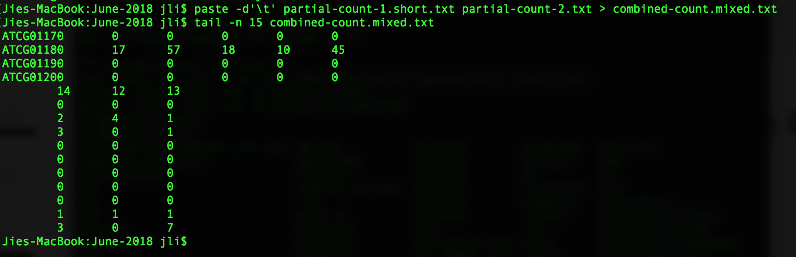

Introduction to CLI
=======================

Before we talk about any command, I just want to reiterate the process to log into the computing cluster. The ways to achieve this is different for MacOs and Windows. For people who use MacOS, open an application called "Terminal" and then use the following command:

    ssh username@ganesh.genomecenter.ucdavis.edu

For people who use Windows, please open the application called "PuTTY" (or MobaXterm, or Linux bash shell on Windows 10),  and go through the set up accordingly.

After logging in, we are on the head node of the computing cluster. **The one most important thing to remember is that NEVER to run jobs on the head node.** To avoid this, we have to get on to one of the computing nodes, where the jobs are supposed to be run. The following command is how we do it.

    srun --time 4:00:00 --reservation=workshop -n 1 --mem 1000 --pty /bin/bash

Another important command to remember while using command line is ^C (Control key and the letter C at the same time). This helps us to get the prompt back in the case when we want to stop a command.

**1\.** Find out where we are

    pwd

---

**2\.** Create a few new directories

First, we are going to create a directory, where we are going to work through this tutorial.

    mkdir Intro2CLI
    cd Intro2CLI

Once we are inside the directory "Intro2CLI", we are going to practice more in creating new directories.

    mkdir test
    mkdir test2

Alternatively, you could have created both directories at once, using ***mkdir test test2***

---

**3\.** Get files from a remote location

    wget https://raw.github.com/ucdavis-bioinformatics-training/2018-June-RNA-Seq-Workshop/master/monday/Intro2CLI-files/art.part1.txt
    wget https://raw.github.com/ucdavis-bioinformatics-training/2018-June-RNA-Seq-Workshop/master/monday/Intro2CLI-files/art.part2.txt
    wget https://raw.github.com/ucdavis-bioinformatics-training/2018-June-RNA-Seq-Workshop/master/monday/Intro2CLI-files/art.part3.txt
    wget https://raw.github.com/ucdavis-bioinformatics-training/2018-June-RNA-Seq-Workshop/master/monday/Intro2CLI-files/all_counts.txt
    wget https://raw.github.com/ucdavis-bioinformatics-training/2018-June-RNA-Seq-Workshop/master/monday/Intro2CLI-files/all_counts.csv
    wget https://raw.github.com/ucdavis-bioinformatics-training/2018-June-RNA-Seq-Workshop/master/monday/Intro2CLI-files/pattern.txt
    wget https://raw.github.com/ucdavis-bioinformatics-training/2018-June-RNA-Seq-Workshop/master/monday/Intro2CLI-files/partial-count-1.txt
    wget https://raw.github.com/ucdavis-bioinformatics-training/2018-June-RNA-Seq-Workshop/master/monday/Intro2CLI-files/partial-count-1.short.txt
    wget https://raw.github.com/ucdavis-bioinformatics-training/2018-June-RNA-Seq-Workshop/master/monday/Intro2CLI-files/partial-count-2.txt
    wget https://raw.github.com/ucdavis-bioinformatics-training/2018-June-RNA-Seq-Workshop/master/monday/Intro2CLI-files/DE.txt

These are files that we are going to use later in the tutorial.

The way to transfer files between your own laptop and the computing cluster that we use is different from Windows to Mac OS. For people who use Mac, it is to use ***scp*** command. The syntax is as following:

    scp files-to-transfer username@ip.address:path2transfer

Where "files-to-transfer" is where you put the name of the file that you want to transfer from you Mac to the cluster. "username" is your own user name on the cluster. "ip.address" is defined either by the hostname (in our case it is ganesh.genomecenter.ucdavis.edu); or it is defined by the IP address of the location (in our case the ip address is 192.168.1.89). For example, if I want to transfer a file on my laptop called transfer.test.txt to the cluster and put it just inside my home directory, the command I would use is:

    scp ~/Jessie/Research/Bioinfo/Course/June-2018/transfer.test.txt jli@ganesh.genomecenter.ucdavis.edu:./

For people who use Windows, there is a package called WinSCP that can be used to do the transfer. It requires some of the same information as using scp above: user name and the hostname/IP. WinSCP will create the connect between your laptop and the cluster, so that you may transfer files by simply drag and drop from one place to another.

---

**4\.** Change directory

    cd

If you are in your home directory when you issue this command, you will notice that you have not changed places. That is because the command without any argument takes you to your home directory. If you were anywhere but your home directory, you will notice that you have changed to your home directory.

Now you can try to provide the command with a path, either absolute, or relative. For example:

    cd ./Intro2CLI/test
    pwd

You will see that you are inside the directory called ***test***, which is inside the directory ***Intro2CLI***, which in turn is in your home directory.

    cd

You will see that you are back to your home directory.

    cd ./Intro2CLI/test
    pwd
    cd ../test2
    pwd

You will see that you went into the directory ***test***, then changed to be inside directory ***test2***, both of these two directories are inside the directory ***Intro2CLI***.

---

**5\.** Create a file

First, we change our current location into the directory ***Intro2CLI***.

    cd ../

Then, type the following command:

    nano

After you give this command, you will see an interface looking like 

At the bottom of the terminal, you see all the commands that are available. To write any text, you just need to start typing. When you are finished, simply use the ***Exit*** command, which is to press the control key and X at the same time. You will be asked whether you want to save the file. Say ***yes***, and then give the name ***test.txt***, hit return and you will have created a new file.

This is one of the text editors that you may use to edit a text file in command. There are many others, such as vi/vim, emacs, ...

---

**6\.** Other ways to create files

First, one may use ***cp*** command to copy a file to another:

    cp test.txt test2.txt

Second, one can also use ***cat*** command to concatenate a few files into one file:

    cat art.part1.txt art.part2.txt art.part3.txt > oliver.art.txt

Here we see a new thing: **>**. This means that the output of the command on the left (before the > ) is written in the file whose name is given on the right: to re-direct the output of the command before it into a file. Otherwise, the output, by default, is to be the standard output (on screen). For example, if we use the command below, it simply show the content of the file on screen.

    cat oliver.art.txt

Since we have sine one way to redirect the output of a command to a file, there is another related method, by using **>>**. The difference between these two ways is that: **>** takes the standard output and write into a file. If the file already exist, it will overwrite the original content. While **>>** will take the standard output and append it into the file.

A third way of creating a file is to use the command ***echo***. ***echo*** is a built-in command in the ***bash*** shell that writes its arguments to standard output. One may redirect the output to a file, in turn creating a file. For example, the command below writes ***Hello World!*** on the screen.

   echo "Hello World!"

If we redirect the output to a file "hello-world.txt", then we will have a file that is called "hello-world.txt" and have the sentence ***Hello World!*** as the content.

   echo "Hello World!" > hello-world.txt

Now that we have learned how to create a file, the next step is to learn a few commands that will allow us to manipulate a file.

---

**7\.** Commands to look at a file

First, in many cases, we could like to take a look at just the first a few lines of a big files. To open the file using a text editor is always one way to do it. But when the size of a file gets bigger, it takes time to open a file using a text editor. The way to do it fast is to use the command ***head***.

    head -n 10 oliver.art.txt

The option **-n** followed by a number (N) tells the command to show the first N lines of a file.

As one can imagine, there is a command to look at the last number of lines of a file, which is ***tail***.

    tail -n 10 oliver.art.txt

There is one very useful command that can show a file page by page, which does not have to read the entire file before displaying, therefore it has advantage when looking at a huge file.

    less all_counts.txt

While stay inside the command, we can search for any pattern that we are interested in, such as a specific gene (ATCG01090). We can do it by issue the command ***/ATCG01090***, followed by hitting the enter key on your keyboard. In order to get out of looking at the file, we simply type **q**. This will give us back the prompt and we can then issue a new command.

---

**8\.** Search for a pattern in a file

In many cases, we want to find all the appearances of a certain pattern. The command we can use is grep.

    grep 'ATCG01090' all_counts.txt

The result of this command is all the lines that match the pattern.

In the case where we have a few patterns that we are interested, we can use an option in grep ***-E***.

    grep -E "ATCG01090|AT1G03997" all_counts.txt

The option ***-E*** tells ***grep*** to use an Extended Regular Expression, where **|** is an logical operator of OR, meaning that we want to search any line that matches the pattern "ATCG01090", or "AT1G03997". The result of this command is the two lines that each matching one pattern. The command ***egrep*** is exactly the same as ***grep -E***.

This command is very good at finding matches for a few patterns. However, sometimes, we might have many more patterns that we want to search. Under this situation, we can use a different option ***-F*** and provide a file that have all the patterns that we are interested in.

    grep -F -f pattern.txt all_counts.txt

The result of this command is all the lines that match any of the patterns in our list in the file pattern.txt. The command ***fgrep*** is the same as ***grep -F***.

---

**9\.** Manipulate a file

The most straightforward way to manipulate a file is to open it in a text editor, such as nano, and make the necessary modification, and then save it. However, when the file is getting big, this way of manipulating a file is very inefficient. Therefore, we are going to use the command ***sed*** to accomplish the goal. "sed" is short for "stream editor". It allows the user to filter and transform the text. The syntax of a sed command is ***sed [OPTIONS] [SCRIPT] [INPUT]***. For example:

    sed 's/\t/,/' sed.txt

This command changes the first occurence of a TAB to a comma. In order to change all occurrence of a TAB to a comma, we would use the following command:

    sed 's/\t/,/g' sed.txt

---

**10\.** Extract specific fields from a file

In the field of bioinformatics, we have to frequently extract specific columns from a file that has a delimiter to separate the columns. We can easily achieve the goal by using the command ***cut***.

    cut -f2,4-10 all_counts.txt > foo

The command above extracts the column 2,4 to 10 from the file "all_counts.txt". By default, the command ***cut*** uses tab as the delimiter. If the file is formatted using a different delimiter, we can add the option of **-d** to specify the specific delimiter of the file. For example, for a file that uses comma as the delimiter, one would add the option of **-d','**.

    cut -d',' -f2,4-10 all_counts.csv > foo2

---

**11\.** Sort a file based on column(s)

In many cases, we would like to sort the rows of a file based on a column, or multiple columns. The command to accomplish this is ***sort***. The example file we have is the result of a differential expression analysis. The first column is the gene names, the second column is the log-fold change, the last column is the adjusted p-value. We are going to sort the file based on two columns: the last field first so that the adjusted p-values are from the smallest to the largest, then the second field so that the fold change is from largest to smallest.

    sort -k5,5g -k2,2rn DE.txt > sorted.DE.txt

---

**12\.** Combine two files side by side

In the situation where it is necessary to combine files by column, the command that can be used to achieve the goal is ***paste***. In the following example, the command combines the two files side by side, using TAB as the delimiter, and the output is redirected into a file "combined-count.txt". If the option **-d'\t'** is not specified, the command uses TAB as the delimiter by default.

    paste -d'\t' partial-count-1.txt partial-count-2.txt > combined-count.txt

To check what the command has done, we are going to take a look at the first a few lines of the files.

    head -5 partial-count-1.txt
    head -5 partial-count-2.txt
    head -5 combined-count.txt

You see that the ***paste*** command has the columns in partial-count-2.txt to partial-count-1.txt. One thing to point out is that ***paste*** does not require the two files to have the same number of rows. For example, I have created a file (partial-count-1.short.txt) from partial-count-1.txt by deleting the last 10 rows. When we paste this shorter file with partial-count-2.txt, the last 10 rows have less number of columns.

    paste -d'\t' partial-count-1.short.txt partial-count-2.txt > combined-count.mixed.txt
    tail -n 15 combined-count.mixed.txt

---

**13\.** Chaining commands together to avoid intermediate files

We have learned many commands now. In bioinformatics analysis, many commands have to be used and many intermediate files are generated if we simply issue each command individually. One way to avoid generating unnecessary intermediate files is to use the syntax of **|**. The **|** allows the output of one command to be the input of another command. For example, we can extract two columns from one file and combine it with another file.

    cut -f3 partial-count-2.txt |paste -d'\t' partial-count-1.txt - > pipe.command.txt

Or we can simply extract a list of genes from a subset of samples from the raw count table.

    cut -f3,5-7 all_counts.txt |grep -E "ATCG01090|AT1G03997" - > genes.of.interest.txt

---

**14\.** For loop

It is very useful to use a for loop when we want to carry out the same command multiple times or on multiple files.

    for i in {1..12}
    do
      echo $i
    done

    for file in all_counts.txt partial-count-1.txt
    do
      head -n 2 $file
    done

---

**15\.** Archive files

In data analysis, there is constant need to archive files for the purpose of storage and sharing. By using the archive command, one may package multiple files/directories all into one. (the syntax is ***tar -cvzf tar.name files)

    tar -cvzf archive-counts.tgz all_counts.txt partial-count-1.txt partial-count-2.txt

---

**16\.** Compression

There are many methods for compression. All methods aim to reduce the size of the file so that it's easier to store files or sharing them. Different command produces different level of compression. We have been using ***bzip2***, which produces very good level of compression.

    ls -l all_counts.txt
    bzip2 all_counts.txt
    ls -l all_counts.txt.bz2

The command to uncompress the bz2 files is ***bunzip2***

    bunzip2 all_counts.txt.bz2

Another commonly used compression method is gzip, which produces less compression than bzip2.

    ls -l all_counts.txt
    gzip all_counts.txt
    ls -l all_counts.txt.gz

The command to uncompress the gz files is ***gunzip***.

    gunzip all_counts.txt.gz

---

**17\.** Create symbolic link

Creating symbolic link is a way to avoid copying files into multiple locations, which in turn increases the usage of disk space unnecessarily. The command is in the format of ***ln -s [target] [linklocation]***.

    ln -s symlink.txt /home/jli/symlink.txt
    ls -l symlink.txt

This tells us that the file symlink.txt at the current location is actually pointing to the file with the same name but located in "/home/jli/".

---

**18\.** Running commands in the background

So far, we have been running a command and wait for it to finish. However, many commands involved in bioinformatics analysis take a long time to finish. In this case, we would like to be able to have the prompt back while the commands are running, so that we can do other things in the meanwhile. The way to have a command to run in the background is to use the following syntax:

    nohup [command] &

This will allow the job to be run, at the same time we have the prompt back for other use. The ***nohup*** at the beginning makes sure that commands are not going to be killed if we log out of the computing node.

---

**19\.** Redirect standard error message

Standard error message is similar to standard output, by default, it is displayed on the screen. We can redirect it to a file to keep a record of it. For example, if we use the command ***cat*** on a non-existent file, an error message will be displayed.

    cat myfile.txt

We can redirect the standard error message to a file, by using the following command:

    cat myfile.txt 2> std.err

We can redirect both the standard output and the standard error message from a command to separate files:

    cat myfile.txt > myfile.copy.txt 2> std.err

---

**20\.** File permission

Each file in the linux system has its permissions set up for the user, the group that the use belongs to, and all the others. For example,

    ls -l *

It shows all the files in a format with the first field providing permission information. Three categories of permission are available: readable, writable, executable. In the first field, the first position shows whether it is a directory (d), or not (-). The second to fourth positions show the three permissions for the user (r:readable, w:writable, x:executable). The next three positions show permissions for the group. The final three positions show the permission for all others.

The way to change the permission of a file is to use the command ***chmod***.

    chmod g+x,o+w test

The above command adds executable permission to the group and writable permission to all others.

---

**21\.** List help and all options for a command

We may use the man page of a command to learn what exactly a command does, as well as what options/parameters a command takes to modify its function. The way to open the man page of a command is to use the command ***man***.

    man ls

---

**22\.** Some tricks to make your life much easier
First and the most important is the use of TAB key. It auto-completes command names, file path. It saves a lot of trouble of typing every single character in a command. For example, in order to finished a command ***cd /home/username/Intro2CLI/test***, you could type ***cd /h***, then hit TAB key, you will get the auto-completed "cd /home/". Then try to type the first letter of your user name, if your user name is unique at each letter, it will auto-complete. If not, by hitting TAB multiple times, the system will list all possibilities starting with the letter you have typed. Add a couple more letters from your user name, at some point it will auto-complete to the path of your home directory "cd /home/username/". Then type "I", followed by the TAB key, and you should get "cd /home/username/Intro2CLI/". Then type "t", followed by the TAB key, and you should get "cd /home/username/Intro2CLI/test".

Secondly, the command ***history***. It lists every single command that you have used up to a certain number0 It is very useful when one wants to recall what he/she has done.

    history > history.txt
    less history.txt

Thirdly, the UP and DOWN arrows on your keyboard. It recalls your previous commands one by one in order, in the case that you want to redo a recent command.

Another thing to remember is that most unix commands have many options/parameters that one may specify. For example, one can recall the last 20 commands in the history by using:

    history 20

Another example is the command ***tail***. The two following commands have only one small difference, but produce completely different results.

    tail -n 20 all_counts.txt
    tail -n +20 all_counts.txt

The first command above produces the last 20 lines of the file "all_counts.txt". The second command produces the part of the same file starting from the 20th line to the end.

The last is the use of wildcard (*). It stands for any character, including letters, numbers, and special characters. For example, if we want to show all the files that starts with "t", we can use the following command:

    ls t*

This command list all files/directories that start with the letter "t".

---

**23\.** Some resources

A list of frequently used unix commands is at [cheatsheet](https://files.fosswire.com/2007/08/fwunixref.pdf)

---
