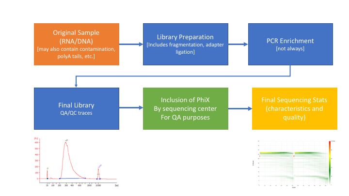
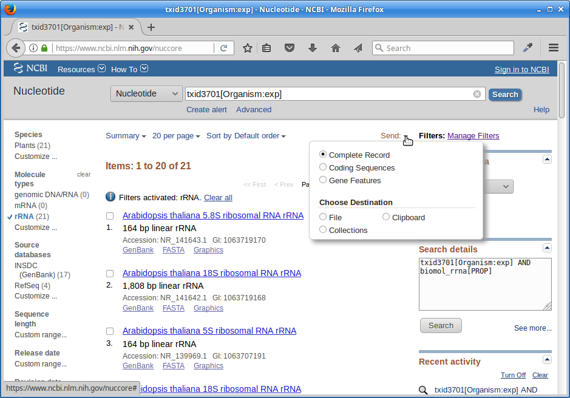
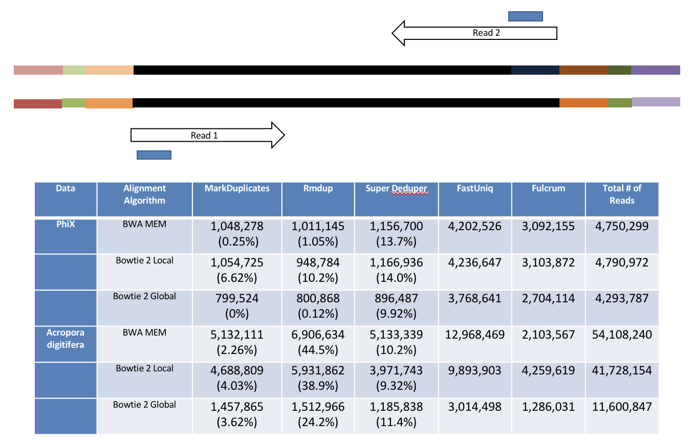
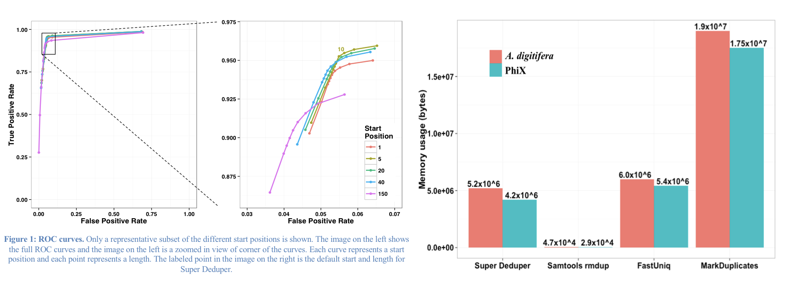
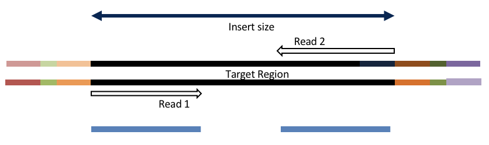
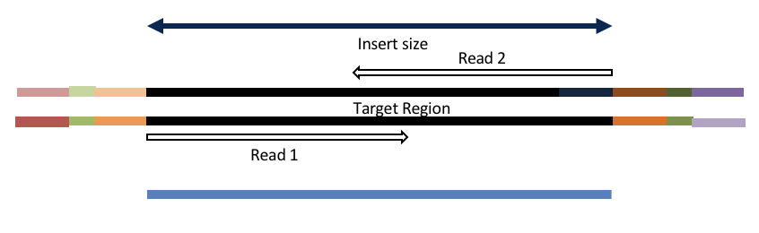
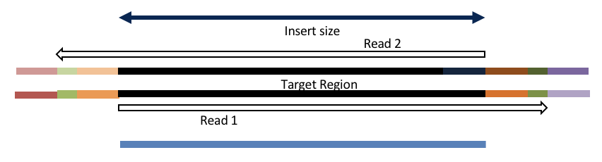
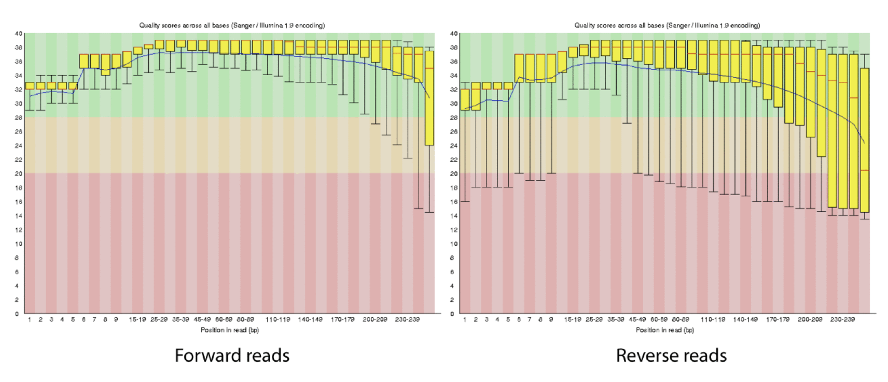

## Sequence preprocessing

**Why preprocess reads**

We have found that aggressively “cleaning” and processing reads can make a large difference to the speed and quality of mapping and assembly results. Cleaning your reads means, removing reads/bases that are:
  * Other unwanted sequence (Ex. polyA tails in RNAseq data)
  * Artificially added onto sequence of primary interest (vectors, adapters, primers)
  * join short overlapping paired-end reads
  * low quality bases
  * originate from PCR duplication
  * not of primary interest (contamination)

Preprocessing also produces a number of statistics that are technical in nature that should be used to evaluate “experimental consistency”.

**Many read preprocessing strategies over time**

* Identity and remove contaminant and vector reads
  * Reads which appear to fully come from extraneous sequence should be removed.
* Quality trim/cut
  * “End” trim a read until the average quality > Q (Lucy)
  * Remove any read with average quality < Q
* Eliminate singletons/duplicates
  * If you have excess depth of coverage, and particularly if you have at least x-fold coverage where x is the read length, then eliminating singletons is a nice way of dramatically reducing the number of error-prone reads.
  * Read which appear the same (particularly paired-end) are often more likely PCR duplicates and therefor redundant reads.
* Eliminate all reads (pairs) containing an “N” character
  * If you can afford the loss of coverage, you might throw away all reads containing Ns.
* Identity and trim off adapter and barcodes if present
  * Believe it or not, the software provided by Illumina, either does not look for, or does a mediocre job of, identifying adapters and removing them.

** Many technical things happen between original sample and data, preprocessing is working backwards through that process to get as close as we can to original sample **



1. Remove contaminants (at least PhiX).
1. Remove PCR duplicates.
1. Identify rRNA proportion.
1. Join and potentially extend, overlapping paired end reads
1. If reads completely overlap they will contain adapter, remove adapters
1. Identify and remove any adapter dimers present
1. Trim sequences (5’ and 3’) by quality score (I like Q20)
1. Cleanup
  * Remove any reads that are less then the minimum length parameter
  * Run a polyA/T trimmer (optional)
  * Produce preprocessing statistics

### HTStream - preprocessing application

Can be downloaded from [here](https://github.com/ibest/HTStream). Fast C++ implementation, designed to have discreet applications that can be pipelined together using unix piping. We hope in the long run to include any and all needed preprocessing routines. Includes:

* hts_AdapterTrimmer - identify and remove adapter sequences
* hts_NTrimmer - extrat the longest subsequence with no Ns
* hts_PolyATTrim - identify and remove polyA/T sequence (least robust algorithm)
* hts_SeqScreener - identify and remove/keep/count contaminants (default phiX)
* hts_SuperDeduper - identify and remove PCR duplicates
* hts_CutTrim - discreet 5' and/or 3' basepair trimming
* hts_Overlapper - Overlap paired end reads (cutting off adapters when present)
* hts_QWindowTrim - 5' and/or 3' prime quality score trimming using windows
* hts_Stats - compute read stats

**1\.** Let's run the first step of our HTStream preprocessing pipeline, which is always to gather basic stats on the read files. For now, we're only going to run one sample through the pipeline.

**1a\.** So let's first take a small subsample of reads, just so our trial run through the pipeline goes really quickly.

    cd ~/rnaseq_example
    mkdir HTS_testing
    cd HTS_testing
    zcat ../00-RawData/C61/C61_S67_L006_R1_001.fastq.gz | head -400000 | gzip > C61.subset_R1.fastq.gz
    zcat ../00-RawData/C61/C61_S67_L006_R2_001.fastq.gz | head -400000 | gzip > C61.subset_R2.fastq.gz
    ls

So we zcat (uncompress and send to screen), pipe to head (param -400000) then pipe to gzip to recompress and name our files subset.

*How many reads are we going to analyze in our subset?*

**1b\.** Now we'll run our first preprocessing step ... hts_Stats, first loading the module and then looking at help.

    cd ~/rnaseq_example/HTS_testing
    module load htstream/0.3.1
    hts_Stats --help

```
msettles@cabernet: ~$hts_Stats -h
HTStream <https://github.com/ibest/HTStream> application: hts_Stats
Version: 0.3.1
The hts_Stats app produce basic statistics about the reads in a dataset.
  Including the basepair composition and number of bases Q30.

Standard Options:
  -v [ --version ]                      Version print
  -h [ --help ]                         Prints help documentation
  -N [ --notes ] arg                    Notes for the stats JSON
  -L [ --stats-file ] arg (=stats.log)  String for output stats file name
  -A [ --append-stats-file ]            Append to stats file

Input Options:
  -1 [ --read1-input ] arg              Read 1 paired end fastq input <space
                                        seperated for multiple files>
  -2 [ --read2-input ] arg              Read 2 paired end fastq input <space
                                        seperated for multiple files>
  -U [ --singleend-input ] arg          Single end read fastq input <space
                                        seperated for multiple files>
  -T [ --tab-input ] arg                Tab input <space seperated for multiple
                                        files>
  -I [ --interleaved-input ] arg        Interleaved fastq input <space
                                        seperated for multiple files>
  -S [ --from-stdin ]                   STDIN input <MUST BE TAB DELIMITED
                                        INPUT>

Output Options:
  -F [ --force ]                        Forces overwrite of files
  -p [ --prefix ] arg (=hts_Stats)      Prefix for output files
  -g [ --gzip-output ]                  Output gzipped files
  -f [ --fastq-output ]                 Output to Fastq format <PE AND/OR SE
                                        files>
  -t [ --tab-output ]                   Output to tab-delimited file format
  -i [ --interleaved-output ]           Output to interleaved fastq file <PE
                                        ONLY>
  -u [ --unmapped-output ]              Output to unmapped sam file format
  -O [ --to-stdout ]                    Output to STDOUT in tab-delimited file
                                        format


Please report any issues, request for enhancement, or comments to <https://github.com/ibest/HTStream/issues>
```

So now lets run hts_Stats and look at the output.

    hts_Stats -1 C61.subset_R1.fastq.gz \
              -2 C61.subset_R2.fastq.gz \
              -L C61.stats.log -f -g -p C61.stats

*What parameters did we use, what do they do?*

Lets take a look at the output of stats

    ls -lah

```
msettles@ganesh: HTS_testing$ls -lah
total 20M
drwxrwxr-x 2 msettles msettles    7 Jun 18 15:07 .
drwxrwxr-x 4 msettles msettles    7 Jun 18 15:04 ..
-rw-rw-r-- 1 msettles msettles  658 Jun 18 15:07 C61.stats.log
-rw-rw-r-- 1 msettles msettles 4.6M Jun 18 15:04 C61.subset_R1.fastq.gz
-rw-rw-r-- 1 msettles msettles 5.0M Jun 18 15:05 C61.subset_R2.fastq.gz
-rw-rw-r-- 1 msettles msettles 4.6M Jun 18 15:07 C61.stats_R1.fastq.gz
-rw-rw-r-- 1 msettles msettles 5.0M Jun 18 15:07 C61.stats_R2.fastq.gz
```

*Which files were generated from hts\_Stats?*

*Lets look at the file C61.stats\.log*

The logs generated by htstream are in [json](https://en.wikipedia.org/wiki/JSON) format, like a database format but meant to be readable.

```
{ "hts_Stats_38989": {
    "Notes": "",
    "totalFragmentsInput": 100000,
    "totalFragmentsOutput": 100000,
    "R1_readlength_histogram": [ [100,100000] ],
    "R2_readlength_histogram": [ [100,100000] ],
    "Base_composition": {
        "A": 5382561,
        "C": 4628992,
        "G": 4586654,
        "T": 5397116,
        "N": 4677
    },
    "Single_end": {
        "SE_in": 0,
        "SE_out": 0,
        "SE_bpLen": 0,
        "SE_bQ30": 0
    },
    "Paired_end": {
        "PE_in": 100000,
        "PE_out": 100000,
        "R1_bpLen": 10000000,
        "R1_bQ30": 9763638,
        "R2_bpLen": 10000000,
        "R2_bQ30": 9561481
    }
  }
}
```

---

**2.** Next we are going to screen from ribosomal RNA (rRNA).

Ribosomal RNA makes up 90% or more of a typical _total RNA_ sample. Most library prep methods attempt to reduce the rRNA representation in a sample, oligoDt binds to polyA tails to enrich a sample for mRNA, where Ribo-depletion binds rRNA sequences to deplete the sample of rRNA. Neither technique is 100% efficient and so knowing the relative proportion of rRNA in each sample can be helpful.

Can screen for rRNA in our sample to determine rRNA efficiency.

**2a.** Before we do so we need to find sequences of ribosomal RNA to screen against.

We will use these sequences to identify rRNA in our reads, which are from Arabidopsis thaliana. One way to do that is to go to [NCBI](https://www.ncbi.nlm.nih.gov/) and search for them.

*1.) First, go to NCBI and in the Search dropdown select "Taxonomy" and search for "arabidopsis".*


*2.) Click on "Arabidopsis".*


*3.) Click on "Arabidopsis" again.*


*4.) Click on the "Subtree links" for Nucleotide*


*5.) Under Molecule Types, click on "rRNA".*


*6.) Click on "Send", choose "File", choose Format "FASTA", and click on "Create File".*




Save this file to your computer, and rename it to 'rrna.fasta'.

Now, make a directory in your "rnaseq_example" directory called "ref":

    cd ~/rnaseq_example
    mkdir ~/rnaseq_example/ref

Upload your rrna.fasta file **to the 'ref' directory** on the cluster using either **scp** or FileZilla. Or if you feel like cheating, paste the contents of rrna.fa using nano into a file named ~/rnaseq_example/ref/rrna.fasta

    nano ~/rnaseq_example/ref/rrna.fasta # paste contents of rrna.fa and save

---

**2b\.** Lets look for ribosomal rna, but not remove, so just count the occurrences.

First, view the help documentation for hts_SeqScreener

    cd ~/rnaseq_example/HTS_testing
    hts_SeqScreener -h

```
msettles@ganesh: HTS_testing$hts_SeqScreener -h
HTStream <https://github.com/ibest/HTStream> application: hts_SeqScreener
Version: 0.3.1
hts_SeqScreener identifies and removes any reads which appear to have originated
  from a contaminant DNA source. Because bacteriophage Phi-X is common spiked
  into Illumina runs for QC purposes, sequences originating from Phi-X are removed
  by default. If other contaminants are suspected their sequence can be supplied
  as a fasta file <seq>, however the algorithm has been tuned for short contaminant
  sequences, and may not work well with sequences significantly longer than Phi-X (5Kb).


Standard Options:
  -v [ --version ]                      Version print
  -h [ --help ]                         Prints help documentation
  -N [ --notes ] arg                    Notes for the stats JSON
  -L [ --stats-file ] arg (=stats.log)  String for output stats file name
  -A [ --append-stats-file ]            Append to stats file

Input Options:
  -1 [ --read1-input ] arg              Read 1 paired end fastq input <space
                                        seperated for multiple files>
  -2 [ --read2-input ] arg              Read 2 paired end fastq input <space
                                        seperated for multiple files>
  -U [ --singleend-input ] arg          Single end read fastq input <space
                                        seperated for multiple files>
  -T [ --tab-input ] arg                Tab input <space seperated for multiple
                                        files>
  -I [ --interleaved-input ] arg        Interleaved fastq input <space
                                        seperated for multiple files>
  -S [ --from-stdin ]                   STDIN input <MUST BE TAB DELIMITED
                                        INPUT>

Output Options:
  -F [ --force ]                        Forces overwrite of files
  -p [ --prefix ] arg (=hts_SeqScreener)
                                        Prefix for output files
  -g [ --gzip-output ]                  Output gzipped files
  -f [ --fastq-output ]                 Output to Fastq format <PE AND/OR SE
                                        files>
  -t [ --tab-output ]                   Output to tab-delimited file format
  -i [ --interleaved-output ]           Output to interleaved fastq file <PE
                                        ONLY>
  -u [ --unmapped-output ]              Output to unmapped sam file format
  -O [ --to-stdout ]                    Output to STDOUT in tab-delimited file
                                        format

Application Specific Options:
  -s [ --seq ] arg                      Please supply a fasta file - default -
                                        Phix Sequence - default
                                        https://www.ncbi.nlm.nih.gov/nuccore/96
                                        26372
  -C [ --check-read-2 ]                 Check R2 as well as R1 (pe)
  -k [ --kmer ] arg (=12)               Kmer size of the lookup table (min 5,
                                        max 256)
  -x [ --percentage-hits ] arg (=0.25)  Proportion of kmer percentage-hits to
                                        sequence need to happen to discard (min
                                        0.0, max 1.0)
  -n [ --inverse ]                      Output reads that are ABOVE the kmer
                                        hit threshold
  -r [ --record ]                       Only record the reads that pass the
                                        kmer hit threshold, output all reads


Please report any issues, request for enhancement, or comments to <https://github.com/ibest/HTStream/issues>
```

*What parameters are needed to 1) provide a reference to hts_SeqScreener and 2) count, and not screen occurrences?*

    hts_SeqScreener -1 C61.subset_R1.fastq.gz \
                    -2 C61.subset_R2.fastq.gz \
                    -s ../ref/rrna.fasta -r -L C61.rrna.log -A -f -g -p C61.rrna

*Which files were generated from hts\_SeqScreener?*

*Lets look at the file C61.rrna.log?*

*What do you notice about the C61.rrna.log?*

*How many reads were identified as rrna?*

**3\.** The power of htstream is the ability to stream reads through multiple programs using pipe's.

By streaming reads through programs processing will be much quicker, each read is read in only once (written only once), and use significantly less storage as there are no intermediate files. It can do this by streaming a tab-delimited format called tab6.

Single end reads are 3 columns:

`read1id  read1seq  read1qual`

Paired end reads are 6 columns:

`read1id  read1seq  read1qual  read2id  read2seq  read2qual`

So lets first run hts_Stats and then hts_SeqScreener in a streamed fashion.

    cd ~/rnaseq_example/HTS_testing

    hts_Stats -1 C61.subset_R1.fastq.gz \
              -2 C61.subset_R2.fastq.gz \
              -L C61.streamed.log -O |
    hts_SeqScreener -S -A -L C61.streamed.log \
              -r -s ../ref/rrna.fasta -f -g -p C61.streamed

Note the pipe between the two applications!

*What new parameters did we use here?*

*What parameter is SeqScreener using that specifies how reads are input?*

**4\.** A RNAseq preprocessing pipeline

1. hts_Stats: get stats on raw reads
1. hts_SeqScreener: screen out (remove) phiX
1. hts_SuperDeduper: identify and remove PCR duplicates
1. hts_SeqScreener: screen for (count) rrnra
1. hts_AdapterTrimmer: identify and remove adapter sequence
1. hts_QWindowTrim: remove poor quality sequence
1. hts_NTrimmer: remove any remaining N characters
1. hts_CutTrim: use to remove all reads < 50bp
1. hts_Stats: get stats out output reads


**4a\.** Why screen for phiX?

PhiX is a common control in Illumina runs, and facilities may not tell you if/when PhiX has been spiked in since it does not have a barcode, so in theory should not be in your data.

However:
* When I know PhiX has been spiked in, I find sequence every time
    * [update] When dual matched barcodes are used, then near zero phiX reads identified.
* When I know PhiX has not been spiked in, I do not find sequence

For RNAseq and variant analysis (any mapping based technique) it is not critical to remove, but for sequence assembly it is. I think its better safe than sorry and screen for it every time.

**4b.** Removing PCR duplicates with hts_SuperDeduper.

Removing PCR duplicates can be **controversial** for RNAseq, but I'm in favor of it. It tells you alot about the original complexity of each sample and potential impact of sequencing depth.

**However, I would never do PCR duplicate removal on single-end reads**


Super Deduper only uses a small portion of the reads to identify duplicates.


We calculated the Youden Index for every combination tested and the point that acquired the highest index value (as compared to Picard MarkDuplicates) occurred at a start position of 5bp and a length of 10bps (20bp total over both reads).

**4c.** Adapter trimming by overlapping reads.

Consider the three scenarios below

**Insert size > length of the number of cycles**



hts_AdapterTrimmer product: original pairs

hts_Overlapper product: original pairs

**Insert size < length of the number of cycles (10bp min)**



hts_AdapterTrimmer product: original pairs

hts_Overlapper product: extended, single

**Insert size < length of the read length**



hts_AdapterTrimmer product: adapter trimmed, pairs

hts_Overlapper product: adapter trimmed, single

Both hts_AdapterTrimmer and hts_Overlapper employ this principle to identify and remove adapters for paired-end reads. For paired-end reads the difference between the two are the output, as overlapper produces single-end reads when the pairs overlap and adapter trimmer keeps the paired end format. For single-end reads, adapter trimmer identifies and removes adapters by looking for the adapter sequence, where overlapper just ignores single-end reads (nothing to overlap).

**4d.** Q-window trimming.

As a sequencing run progresses the quality scores tend to get worse, so its common to trim of the worst quality bases.



This is how reads commonly look, the start at "good" quality, increase to "excellent" and degrade to "poor", with R2 always looking worse (except when they don't) than R1 and get worse as the number of cycles increases.

hts_QWindowTrim trim 5' and/or 3' end of the sequence using a windowing (average quality in window) approach.

**4e.** what does all this preprocessing get you

Comparing star mapping with raw and preprocessed reads


**5.** Lets put it all together

    hts_Stats -O -L C61_htsStats.log -1 C61.subset_R1.fastq.gz -2 C61.subset_R2.fastq.gz | \
    hts_SeqScreener -S -O -A -L C61_htsStats.log | \
    hts_SuperDeduper -e 250000 -S -O -A -L C61_htsStats.log | \
    hts_SeqScreener -s ../ref/rrna.fasta -r -S -O -A -L C61_htsStats.log | \
    hts_AdapterTrimmer -n -S -O -A -L C61_htsStats.log | \
    hts_QWindowTrim -n -S -O -A -L C61_htsStats.log | \
    hts_NTrimmer -n -S -O -A -L C61_htsStats.log | \
    hts_CutTrim -n -m 50 -S -O -A -L C61_htsStats.log | \
    hts_Stats -S -A -L C61_htsStats.log -g -p C61.htstream

Note the patterns:
* In the first routine we use -1 and -2 to specify the original reads and -O to output to standard output.
* In the middle routines we use -S to read in from standard input and -O to write out to standard output.
* In the final routine we use -S to read in from standard input and -g (gzipped output) and -p fastq prefix to write out new preprocessed reads.
* For the log, we specify -L with the same log file name for all routines, and use -A for the second routine onward to append log output, generating a single log file at the end.
* All other parameters are algorithm specific, can review using --help

*Review the final json output, how many reads do we have left?*

*Confirm that number by counting the number of reads in the final output files.*

*How many adapters did we detect, cut off?*

*How many PCR duplicates were there?*

*Anything else interesting?*

---

**6\.** We can now run the preprocessing routine across all samples on the real data using a SLURM script, [hts_preproc.slurm](./hts_preproc.slurm), that we should take a look at now.

    cd ~/rnaseq_example  # We'll run this from the main directory
    cp /share/biocore/workshops/2018_June_RNAseq/hts_preproc.slurm .
    cat hts_preproc.slurm
    mkdir slurmout

After looking at the script, lets make a slurmout directory for the output to go and let's run it. First we'll need to produce a list of samples for the script to work on.

    sbatch hts_preproc.slurm  # moment of truth!

We can watch the progress of our task array using the 'squeue' command. Takes about 30 minutes to process each sample.

    squeue -u class42  # use your actual username, no brackets

---

**7.** Preprocessing statistics as QA/QC.

Beyond generating "better" data for downstream analysis, cleaning statistics also give you an idea as to the original quality and complexity of the sample, library generation, and sequencing quality.

This can help inform you of how you might change your procedures in the future, either sample preparation, or in library preparation.

I’ve found it best to perform QA/QC on both the run as a whole (poor samples can affect other samples) and on the samples themselves as they compare to other samples (BE CONSISTENT).

Reports such as Basespace for Illumina, are great ways to evaluate the run as a whole, the sequencing provider usually does this for you.
PCA/MDS plots of the preprocessing summary are a great way to look for technical bias across your experiment. Poor quality samples often appear as outliers on the MDS plot and can ethically be removed due to identified technical issues.

**8\.** Let's make sure that all jobs completed successfully.

Lets first check all the "htstream_%\*.out" and "htstream_%\*.err" files:

    cd ~/rnaseq_example
    cat slurmout/htstream_*.out

Look through the output and make sure you don't see any errors. Now do the same for the err files:

    cat slurmout/htstream_*.err

Also, check the output files. First check the number of forward and reverse output files (should be 24 each):

    cd 01-HTS_Preproc
    ls */*R1* | wc -l
    ls */*R2* | wc -l

Check the sizes of the files as well. Make sure there are no zero or near-zero size files and also make sure that the size of the files are in the same ballpark as each other:

    ls -lh *

If, for some reason, your jobs did not finish or something else went wrong, please let one of us know and we will help.

---

**9.** Let's take a look at the differences between the input and output files. First look at the input file:

    cd ~/rnaseq_example
    zless 00-RawData/I894/I894_S90_L006_R1_001.fastq.gz

Let's search for the adapter sequence. Type '/' (a forward slash), and then type **AGATCGGAAGAGCACACGTCTGAACTCCAGTCAC** (the first part of the forward adapter). Press Enter. This will search for the sequence in the file and highlight each time it is found. You can now type "n" to cycle through the places where it is found. When you are done, type "q" to exit.

Now look at the output file:

    zless 01-HTS_Preproc/I894/I894_R1.fastq.gz

If you scroll through the data (using the spacebar), you will see that some of the sequences have been trimmed. Now, try searching for **AGATCGGAAGAGCACACGTCTGAACTCCAGTCAC** again. You shouldn't find it (adapters were trimmed remember). You may need to use Control-C to get out of the search and then "q" to exit the 'less' screen.

---

**10.** QA/QC Summary table of the json files.

I've created a small R script to read in each json file, pull out some relevant stats and write out a table for all samples.

    cd ~/rnaseq_example  # We'll run this from the main directory
    cp /share/biocore/workshops/2018_June_RNAseq/summarize_stats.R .

    R CMD BATCH summarize_stats.R
    cat summary_hts.txt

Lets move this file to our computer, using scp or winSCP, or copy/paste from cat [sometimes doesn't work], open in excel (or excel like application), you may have to move the header column 1 cell to the right, and lets review.

*Any problematic samples?*

*Anything else worth discussing?*

**11.** Scripts

slurm script for preprocessing using slurm task array and htstream

[hts_preproc.slurm](./hts_preproc.slurm)

shell script for preprocessing using bash loop and htstream.

[hts_preproc.sh](./hts_preproc.sh)

R script to produce summary table, assumes exact htstream operations and order as described above.

[summary_stats.R](./summarize_stats.R)
