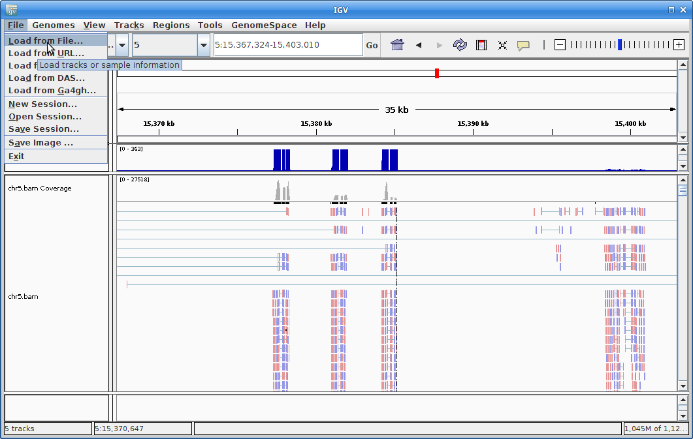

Alignment to Read Counts & Visualization in IGV
================================================

In this section we will align reads to the genome, view some alignments, and assign counts to genes. **Log into a compute node using srun first! Do not run on the head node!**

**1\.** First, let's make sure that your jobs from yesterday completed. Go back to your '01-Trimming' directory and first check all the "arrayJob\*.out" and "arrayJob\*.err" files:

    cd ~/rnaseq_example/01-Trimming
    cat arrayJob*.out

Look through the output and make sure you don't see any errors. Now do the same for the err files:

    cat arrayJob*.err

Also, check the output files. First check the number of forward and reverse output files (should be 24 each):

    ls *.sickle.R1.fastq | wc -l
    ls *.sickle.R2.fastq | wc -l

Check the sizes of the files as well. Make sure there are no zero or near-zero size files and also make sure that the size of the files are in the same ballpark as each other:

    ls -lh *.sickle.R1.fastq
    ls -lh *.sickle.R2.fastq

If, for some reason, your jobs did not finish or something else went wrong, please let one of us know and we can get you caught up.

---

**2\.** To align our data we will need the genome and annotation for Arabidopsis thaliana. There are many places to find them, but we are going to get them from the Ensembl Genomes FTP site. In a browser, go to here:

    ftp://ftp.ensemblgenomes.org/pub/plants/release-36/

Navigate through the directories to find a GTF (**NOT** GFF3) annotation file for Arabidopsis thaliana, as well as a complete genome. The genome file is "Arabidopsis_thaliana.TAIR10.dna.toplevel.fa.gz" and the annotation file is "Arabidopsis_thaliana.TAIR10.36.gtf.gz". When you find those files, copy the location links and use wget to add them to your ref directory:

    cd ~/rnaseq_example/ref
    wget <link to genome>
    wget <link to annotation>

Finally, you will need to use gunzip to uncompress the files:

    gunzip Arabidopsis_thaliana.TAIR10.dna.toplevel.fa.gz
    gunzip Arabidopsis_thaliana.TAIR10.36.gtf.gz

Take a look at the GTF file:

    less Arabidopsis_thaliana.TAIR10.36.gtf

Press 'q' to exit this screen.

---

**2\.** Now, let's make an alignment directory and link all of our sickle paired-end files (we are not going to use the singletons) into the directory:

    cd ~/rnaseq_example
    mkdir 03-alignment
    cd 03-alignment
    ln -s ../01-Trimming/*sickle.R*.fastq .

We are going to use an aligner called 'STAR' to align the data, but in order to use star we need to index the genome for star. So go back to your ref directory and let's do the indexing (**Note that the STAR command below has been put on multiple lines for readability**). We specify 4 threads, the output directory, the fasta file for the genome, the annotation file (GTF), and the overhang parameter, which is calculated by subtracting 1 from the read length.

    cd ../ref
    module load star
    mkdir star_index
    
    STAR --runThreadN 4 \
    --runMode genomeGenerate \
    --genomeDir star_index \
    --genomeFastaFiles Arabidopsis_thaliana.TAIR10.dna.toplevel.fa \
    --sjdbGTFfile Arabidopsis_thaliana.TAIR10.36.gtf \
    --sjdbOverhang 99

This step will take 5 minutes. You can look at the [STAR documentation](https://github.com/alexdobin/STAR/blob/master/doc/STARmanual.pdf) while you wait. All of the output files will be written to the star_index directory. 

---

**3\.** We are now ready to try an alignment of one of our samples' reads. Let's go back to our 03-alignment directory and make an output directory for STAR:

    cd ../03-alignment
    mkdir I864_S78_star_alignment

and let's run STAR on just one pair of files. Make sure you run this on a compute node using 8Gb of memory. It will take about 30 minutes to run (**Again, the command is on multiple lines for readability**):

    STAR --runThreadN 8 \
    --sjdbOverhang 99 \
    --genomeDir ../ref/star_index \
    --sjdbGTFtagExonParentGene gene_id \
    --sjdbGTFfile ../ref/Arabidopsis_thaliana.TAIR10.36.gtf \
    --outSAMtype BAM Unsorted SortedByCoordinate \
    --outReadsUnmapped Fastx \
    --quantMode GeneCounts \
    --outFileNamePrefix I864_S78_star_alignment/I864_S78_ \
    --readFilesIn I864_S78.sickle.R1.fastq I864_S78.sickle.R2.fastq

For this command, we are giving it the overhang like from the previous step, the genome index directory we created in the last step, an identifier name from the GTF file that identifies genes, the annotation file, the output file type, outputting unmapped reads, telling it to count reads on a gene level, the prefix for all the output files, and finally, the input files.

---

**4\.** While that is running, let's take a look at an alignment in IGV. We are going to take an already done alignment and cut it down so that it is small enough to download easily. First, let's take just the chromosome 5 portion of the alignment for the I864_S78 sample. We will use 'samtools' for this step, which is a program to manipulate SAM/BAM files. Take a look at the options for samtools and 'samtools view':

    module load samtools
    samtools
    samtools view

Now, use the 'samtools view' command to extract just chromosome 5 of an already completed alignment:

    samtools view -b -@ 8 -o chr5.bam /home/class1/rnaseq_example/03-alignment/I864_S78_star_alignment/I864_S78_Aligned.sortedByCoord.out.bam 5

We need to index the new BAM file:

    samtools index chr5.bam

Now, download chr5.bam and chr5.bam.bai (the index file) to your laptop. You will also need to download and uncompress both the Arabidopsis thaliana genome and annotation to your laptop. Just go back to where you got them before and instead of using wget, just download them directly to your laptop. And make sure to uncompress them.

---

**5\.** Now we are ready to use IGV. Go to the [IGV page at the Broad Institute](http://software.broadinstitute.org/software/igv/) and click on Downloads.

Scroll down the page and under "Java Web Start" click on the "Launch" button with 1.2Gb of memory. This will download a ".jnlp" file which will need to be run using Java Web Start (javaws). If you don't have this on your computer, you will need to install it.

---

**6\.** IGV should start up automatically. The first thing we want to do is load our Arabidopsis genome. Click on "Genomes" in the menu and choose "Load Genome from File":

Find your genome file on your laptop and choose that:

---

**7\.** Now let's load the alignment. Click on "File" and choose "Load from File":

Choose your chr5.bam file. Make sure the chr.bam.bai file is in the same directory as the BAM file.

Now your alignment is loaded. Any loaded file aligned to a genome is called a "track".

---

**8\.** Choose chromosome 5 from the chromosome dropdown:

You will need to zoom in to see alignments, so click on the plus sign until you see something. You also may have to move around by clicking and dragging in the BAM track window.

You can also zoom in by clicking and dragging across the number line at the top. That section will highlight, and when you release the button, it will zoom into that section.

---

**9\.** In order to see alignments more easily when zoomed out, we are going to create a coverage track. Click on "Tools" and then choose "Run igvtools".

Choose "Count" as the command, and choose your chr5.bam file as the Input File (the output file path will get created automatically):

Choose a Zoom Level of 10 and then click "Run":

---

**10\.** Once that is done, there will be a chr5.bam.tdf file in the same directory as your bam file. Click on "File" and "Load from File" and choose that file. This will create a coverage track that is visible even at maximum zoom out.

Click on the minus sign in the upper right to zoom out. Zoom out until you are all the way zoomed out. The alignment track will not show anything, but you will be able to see the coverage track which will show you the locations of the alignments.

Zoom in by clicking and dragging across the number line until you get to some alignments. You are looking at a visual representation of the alignment of the reads to the genome. Each of the little boxes in the track represent reads. The reads can be visualized in different ways which we will show you in class.

---

**11\.** The other track we will add to IGV is the annotation for Arabidopsis. In order to do that, we need to first sort the annotation file. Go to igvtools again:

Choose "Sort" as the command and choose the gtf annotation file as the input file. Run it:

--

**12\.** Load the newly created and sorted gtf file:

It will give you a warning about not having an index file. Click "Go" to create one:

---

**13\.** Once the annotation track is loaded, zoom into a gene and you will see that the reads should be aligning with the exons in the genes. This makes sense, since RNA-Seq reads are from exons:

---

**14\.** Ok, let's go back to the command-line. If your STAR job hasn't finished, just open another terminal and log into cabernet. Now we are going to run all of the STAR alignments on the cluster. This is something to run at the end of the day. The first thing to do is to link to our samples.txt file:

    cd ~/rnaseq_example/03-alignment
    ln -s ../01-Trimming/samples.txt

Next, download a slurm task array file called star.sh:

    wget https://ucdavis-bioinformatics-training.github.io/2017-June-RNA-Seq-Workshop/wednesday/star.sh

This file is not complete. The variables for the reference directory and the GTF annotation file are blank. You need to use nano (the text editor) to add the full paths of the reference directory and the GTF annotation file. Once you do that and save the file, you can move on to the final step.

    nano star.sh

Find the paths you need and add them to the correct spots in the script. You may need to open another terminal. Save the file and exit nano.

---

**15\.** First, take look at the file:

    cat star.sh

It looks very similar to our previous task array file, except we are running STAR, so we are using a few more variables. If everything is set up properly, then all you have to do is use sbatch:

    sbatch star.sh

You will want to use 'squeue' to make sure that your jobs are actually running. If your jobs finish quickly, then something went wrong.

    squeue -u <your username>

And now you wait.
